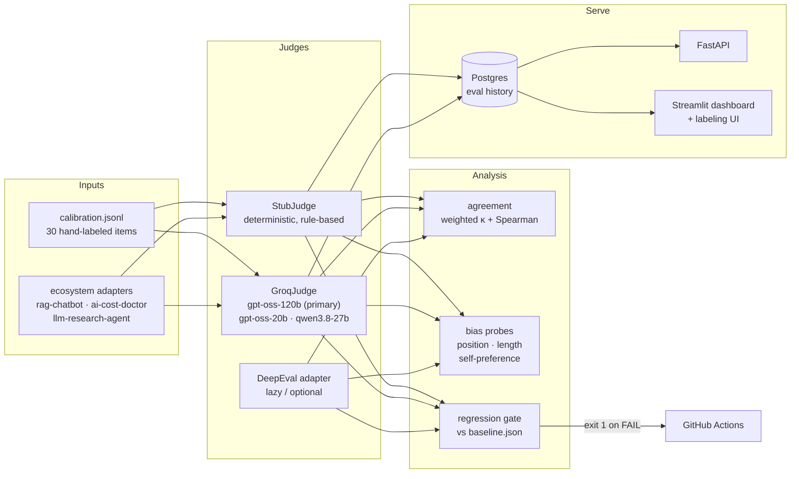
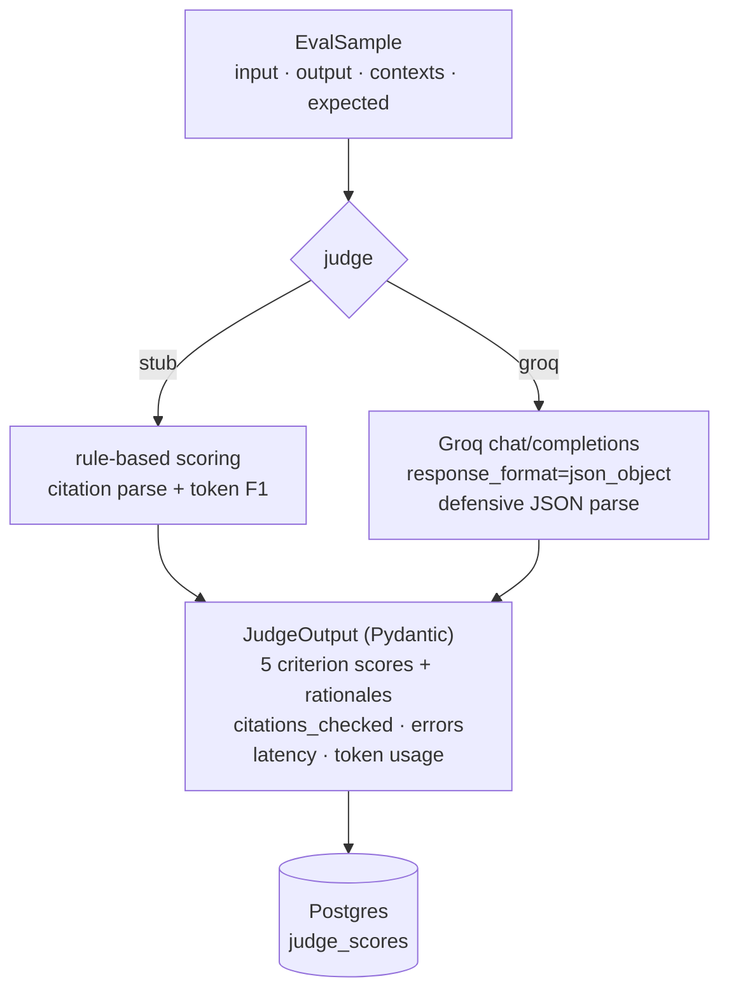
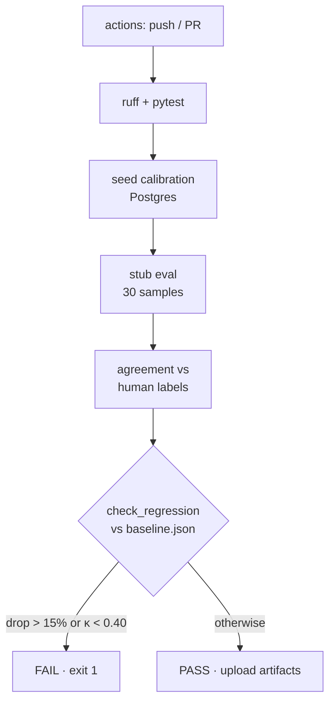

# LLM Evaluation Platform

A production-style **LLM-as-judge** evaluation platform for RAG systems:
exact rubric, structured judge outputs, a hand-labeled calibration set,
agreement + bias analysis, a CI regression gate, eval history in Postgres,
and a human-labeling dashboard.

## Problem

RAG answers fail in ways BLEU/ROUGE can't see: citations that point at the
wrong chunk, claims the retrieved context doesn't support, fluent but empty
answers. This platform scores answers against a **5-criterion rubric** with
two judges — a deterministic rule-based judge for CI and a real Groq LLM
judge for semantic depth — and proves each judge's quality by measuring
**agreement against human labels** (quadratic-weighted Cohen's κ, Spearman ρ).

## Architecture



### Judge pipeline (per sample)



### CI gate



## Quickstart

```bash
git clone https://github.com/rupak-eng/llm-evaluation-platform
cd llm-evaluation-platform
make setup && make test          # 30 pytest, ruff
make seed                        # load calibration set + human labels

# local dev against the shared portfolio Postgres:
export DATABASE_URL=postgresql+psycopg2://portfolio:<dev-password>@127.0.0.1:5432/portfolio
export LLMEVAL_DB_SCHEMA=llmeval
make seed
PYTHONPATH=src python -m llmeval.runner --dataset calibration --judge stub --run-id demo-001

make ci-local                      # agreement + regression gate (exit 1 on FAIL)
make dashboard                     # Streamlit: scores, agreement, bias, labeling UI
```

Docker (production topology — Postgres + API + dashboard):

```bash
docker compose up --build   # needs a Docker daemon; not run in this environment
```

## Configuration

| Variable | Default | Purpose |
|---|---|---|
| `DATABASE_URL` | `sqlite:///./llmeval.db` | Postgres in prod; SQLite fallback for tests |
| `LLMEVAL_DB_SCHEMA` | _(none)_ | Schema for our tables on shared Postgres (`llmeval`) |
| `JUDGE_PROVIDER` | `stub` | `stub` \| `groq` \| `openai_compat` \| `deepeval` |
| `GROQ_API_KEY` | _(vault `custom.groq`)_ | Transient; never committed. Falls back to Secure Vault surrogate |
| `JUDGE_MODEL` | `openai/gpt-oss-120b` | Groq model id |
| `EVAL_SEED` | `42` | Sampling seed |
| `REGRESSION_MAX_DROP` | `0.15` | Max relative per-criterion drop vs baseline |
| `REGRESSION_MIN_KAPPA` | `0.40` | Min overall weighted κ vs baseline |

## API / CLI reference

**CLI**

```bash
# run an eval
PYTHONPATH=src python -m llmeval.runner --dataset calibration --judge stub --run-id my-run
PYTHONPATH=src python -m llmeval.runner --dataset calibration --judge groq --model openai/gpt-oss-20b

# real-judge benchmark with token/cost accounting + agreement
PYTHONPATH=src python bench/scripts/run_groq_benchmark.py --model openai/gpt-oss-120b

# bias probes
PYTHONPATH=src python bench/scripts/run_position_bias.py --model openai/gpt-oss-120b --pairs 8
PYTHONPATH=src python bench/scripts/run_selfpreference.py   # 3 judges × 2 generator models, blind

# regression gate (also the CI step)
PYTHONPATH=src python bench/scripts/ci_gate.py              # exit 1 on FAIL
PYTHONPATH=src python bench/scripts/degraded_demo.py        # proves the gate fires (exit 2)
```

**REST (FastAPI, default :8020)**

```bash
curl localhost:8020/health
curl -X POST localhost:8020/labels -H 'Content-Type: application/json' \
  -d '{"sample_id":"rev-good","labeler":"manual-rubric-pass-v1","scores":{"citation_precision":5}}'
curl localhost:8020/runs
curl localhost:8020/runs/pg-portfolio-001
```

## Benchmark methodology

1. **Calibration set** — `adapters/fixtures/calibration.jsonl`: 30 items =
   10 scenarios (revenue, margin, CEO, concentration, segments, debt, R&D,
   capex, litigation, dividends) × good / mediocre / broken. Corpus is
   explicitly fictional ("Meridian Dynamics FY2024 10-K-style").
2. **Human labels** — `human_label/seed_labels.jsonl`, labeler
   `manual-rubric-pass-v1` (labeled by the engineering agent against the
   written rubric; see `human_label/LABELING_GUIDE.md`). Honest provenance:
   not presented as third-party annotation.
3. **Rubric** — 5 criteria, 1–5 ordinal each: citation_precision,
   citation_recall, faithfulness, answer_f1, conciseness.
4. **Agreement** — quadratic-weighted Cohen's κ + Spearman ρ per criterion
   and overall, judge vs human labels. Implementation hand-rolled
   (`src/llmeval/agreement.py`), cross-checked in tests.
5. **Bias** — position flip rate (pairwise, both orders), output-length vs
   score Spearman, self-preference (styled-judge delta + two-model
   generative test with blind judges).
6. **Regression** — `check_regression` vs committed `bench/results/baseline.json`.

## Measured results

All numbers below are read from committed artifacts in `bench/results/`.
Nothing here is estimated or invented.

### Deterministic stub judge vs human labels (n=30)

| Criterion | Mean | Weighted κ | Spearman ρ |
|---|---|---:|---:|
| citation_precision | 3.200 | 0.930 | 0.930 |
| citation_recall | 2.633 | 0.906 | 0.895 |
| faithfulness | 3.133 | 0.853 | 0.853 |
| answer_f1 | 2.433 | 0.674 | 0.853 |
| conciseness | 4.833 | 0.872 | 0.892 |
| **overall** | — | **0.907** | **0.917** |

Source: `bench/results/baseline-stub-001.json`, `bench/results/analysis.json`.

### Real provider: Groq `openai/gpt-oss-120b` vs human labels (n=30)

| Criterion | Mean | Weighted κ | Spearman ρ |
|---|---|---:|---:|
| citation_precision | 3.133 | 0.993 | 0.970 |
| citation_recall | 2.867 | 0.893 | 0.972 |
| faithfulness | 3.167 | 0.976 | 0.981 |
| answer_f1 | 3.133 | 0.924 | 0.895 |
| conciseness | 4.833 | 0.640 | 0.686 |
| **overall** | — | **0.984** | **0.968** |

Provenance: provider `groq`, model `openai/gpt-oss-120b` (Groq exposes the
model id only — no separate version string), 30/30 samples judged clean,
2026-09-30. Source: `bench/results/groq-openai-gpt-oss-120b.json`.

**Cost/latency (measured, not modeled):** 63,862 tokens total (24,303
prompt / 39,559 completion incl. 29,904 reasoning), mean latency 6.3s/call.
Estimated cost **$0.0274** for 30 samples (~$0.001/sample) at Groq's
published rates ($0.15/$0.60 per 1M in/out, 2026-09-30 — re-verify at
console.groq.com before budgeting).

### Bias measurements

| Test | Result |
|---|---|
| Position flip rate (stub, 10 pairs) | 0.000 — expected: the stub is order-independent |
| Position flip rate (Groq gpt-oss-120b, 8 pairs) | see `bench/results/position-bias-groq.json` |
| Length vs score Spearman (stub) | ρ=0.264, p=0.158, n=30 — not significant |
| Self-preference, styled stub | Δ=0.317 vs plain-stub control Δ=0.000 |
| Self-preference, 3 Groq judges × 2 generator models (blind) | see `bench/results/selfpreference-groq.json` |

### Regression gate

Degraded variant (all citations stripped): citation_precision **−68.8%**,
citation_recall **−62.0%** → gate **FAIL**, exit 2. Captured:
`demo/degraded-gate.log`, `demo/degraded-verdict.json`. Healthy gate:
**PASS**, overall κ=0.907 (`bench/results/ci-gate.json`).

### Biggest disagreement (honest failure case)

`div-broken`: human-vs-judge total gap 9. The token-overlap judge treated a
semantically contradictory dividend claim as supported because lexical
overlap exceeded 50%. This is why the roadmap replaces the overlap
heuristic with an NLI/entailment check.

## What didn't work / sharp edges

- **Groq behind Cloudflare**: requests without a browser `User-Agent` get
  HTTP 403 error 1010. Fixed with an explicit header.
- **Model availability**: the key serves `openai/gpt-oss-120b`,
  `openai/gpt-oss-20b`, `qwen/qwen3.8-27b` — `llama-3.3-70b-versatile` is
  enterprise-only and not on this key, despite appearing in older docs.
- **Rate limits**: 3 concurrent judges hit 429s; the judge now honors
  `Retry-After`, backs off (≤60s, 6 retries), and benchmarks serialize to
  1 worker plus `--resume` so partial runs are never lost.
- **Terse gpt-oss output**: the JSON parser strips fences, brace-matches,
  normalizes criterion names, and records errors instead of crashing.
- **Postgres caught a real bug SQLite masked**: `Store.save_run` added the
  parent `eval_runs` row and child `bias_reports` rows in one session;
  without `relationship()`s the unit of work orders new objects
  alphabetically by mapper name ("BiasReportRow" < "EvalRun"), so the
  child INSERT fired first → `ForeignKeyViolation` on Postgres. Fixed with
  an explicit `flush()` after adding the parent. `judge_scores` only ever
  worked by alphabetical luck ("EvalRun" < "JudgeScore").
- **Docker daemon unavailable** in this environment: `Dockerfile` and
  `docker-compose.yml` are written and YAML-validated but `compose up`
  was not executed. Stated, not hidden.

## Ecosystem linkage

Sibling portfolio repos emit the shared native JSONL schema
(`input`, `output`, `contexts[{text,source,chunk_id}]`, `expected`,
`metadata`). `adapters/ecosystem.py` maps each repo's field layout to it;
`adapters/examples/` has validated records per repo:

- **rag-chatbot** → answer faithfulness / citation checks on chat logs
- **ai-cost-doctor** → investigation-report grounding checks
- **llm-research-agent** → source-faithfulness of research summaries

## DeepEval

`src/llmeval/judges/deepeval_adapter.py` wraps DeepEval lazily (optional
dependency, `requirements-optional.txt`). It is **not executed** in the
reported benchmarks — no provider key was wired for it and the protocol
above uses the stub + Groq judges. It exists as the triangulation path:
a third judge family for future runs.

## Swapping providers

Implement the two-method judge interface (`judge(sample) -> JudgeOutput`,
`judge_name`) — see `src/llmeval/judges/base.py`. The Groq provider
(`src/llmeval/judges/groq.py`) is the reference: auth resolution
(transient env → vault surrogate, never logged), structured-output
prompting, defensive parsing, token/latency accounting. Point
`JUDGE_PROVIDER`/`JUDGE_MODEL` at the new class via
`runner.make_judge` and the whole protocol (agreement, bias, gate,
history) works unchanged.

## Contributing

`make test && make lint` must pass. New criteria go in `src/llmeval/rubric.py`
with tests in `tests/`. Calibration changes require re-running the full
protocol and recommitting `bench/results/baseline.json` with a note.

## License

MIT.
